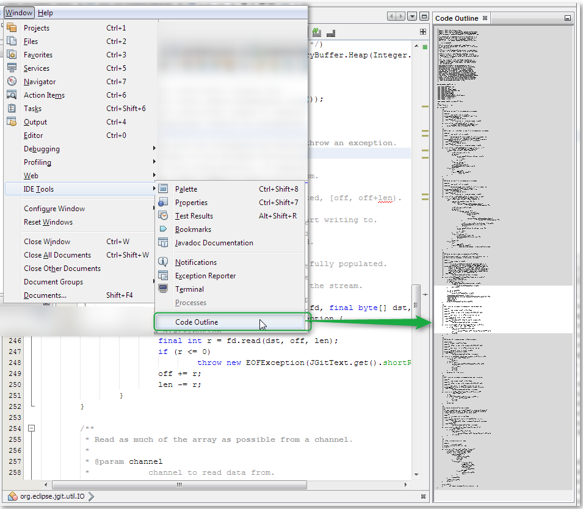

# nb-codeoutline
This a NetBeans plugin which adds a code overview/outline for the current editor.

Implements https://netbeans.org/bugzilla/show_bug.cgi?id=199663

Compatible to NetBeans 8.0+ and JDK7+.

License: GPL 2 - <a href="http://www.gnu.org/licenses/gpl-2.0.txt">http://www.gnu.org/licenses/gpl-2.0.txt</a>. This plugin integrates some sourcecode from <a href="http://www.bluej.org/">http://www.bluej.org/</a>. The copyright for BlueJ is held by M. Kölling and J. Rosenberg.
BlueJ is available under the GNU General Public License version 2 with the Classpath Exception

